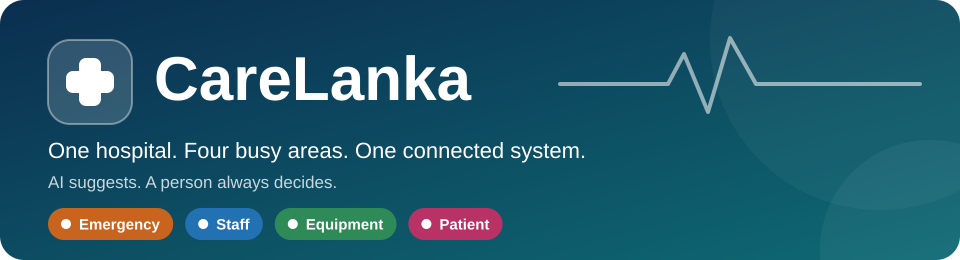
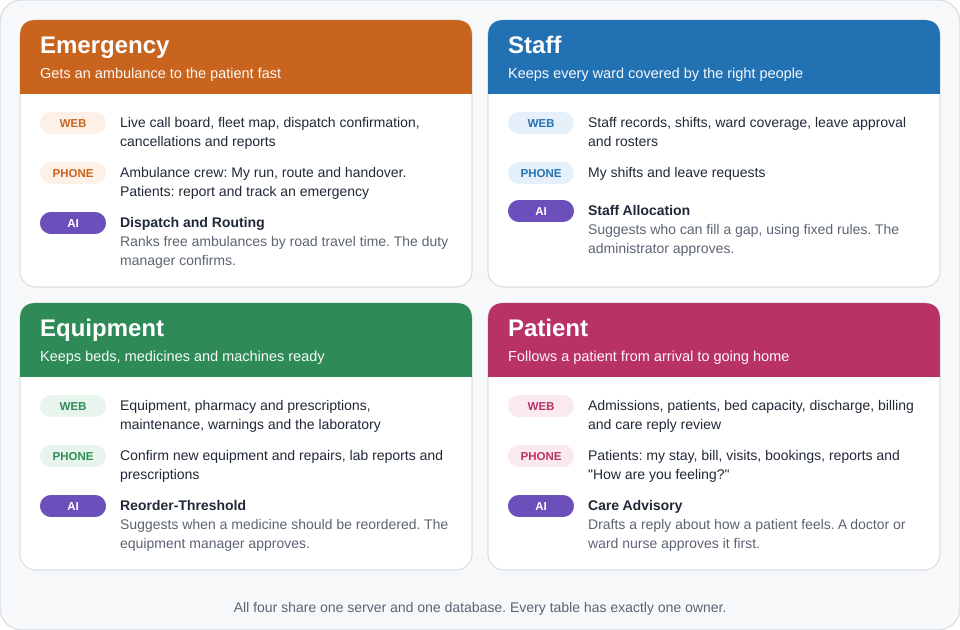
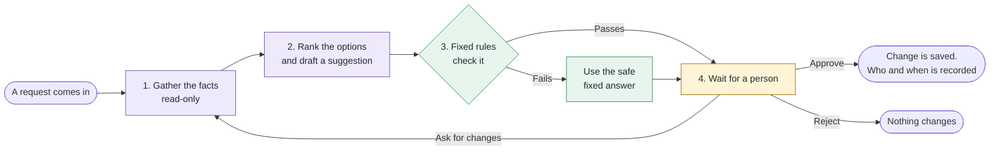
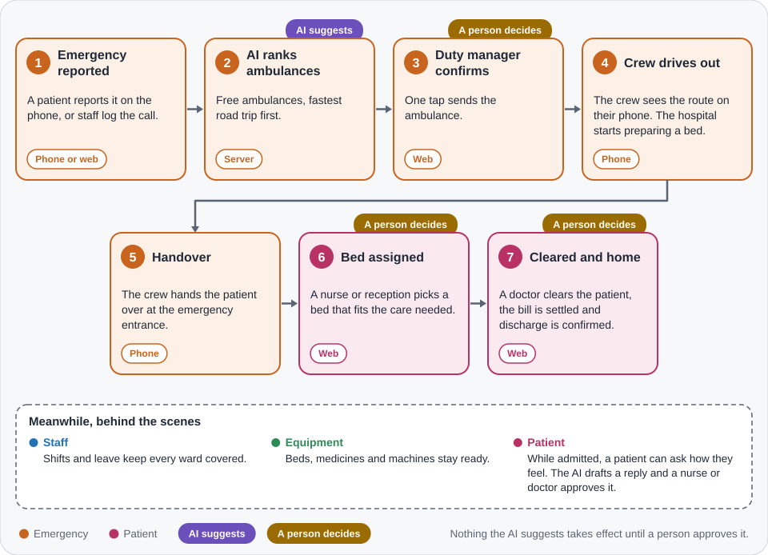
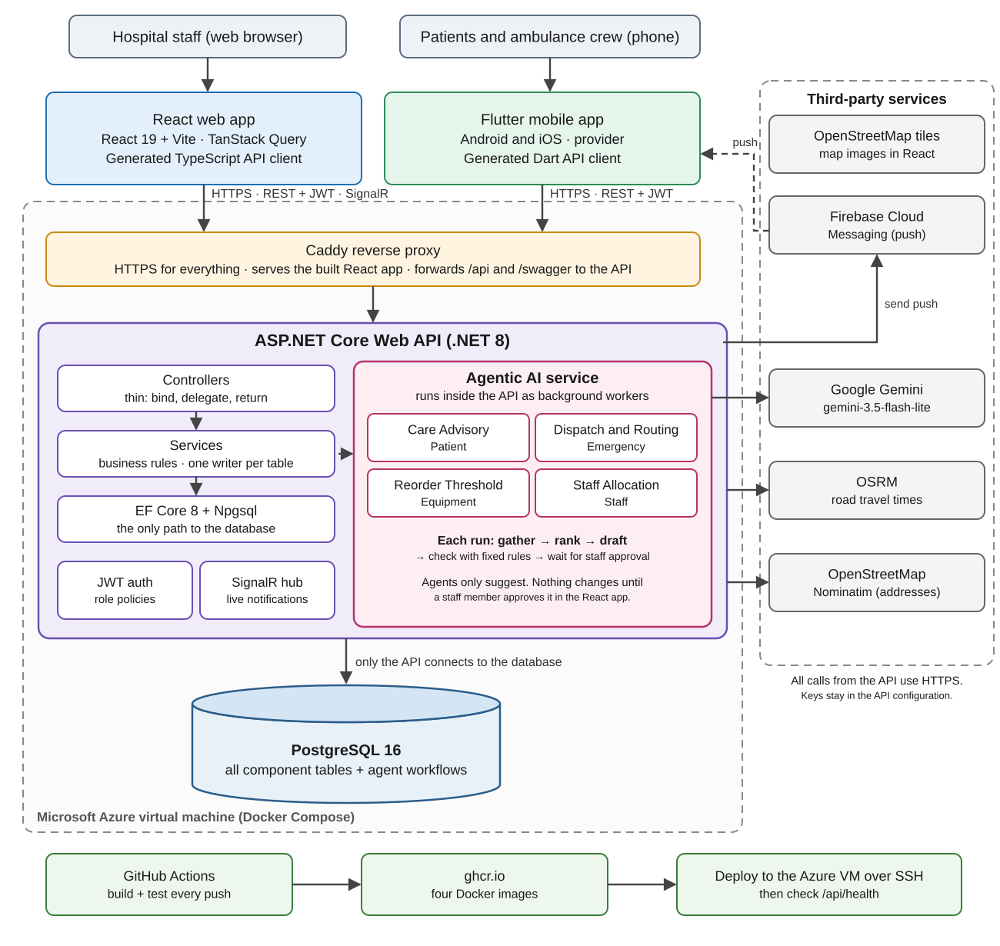
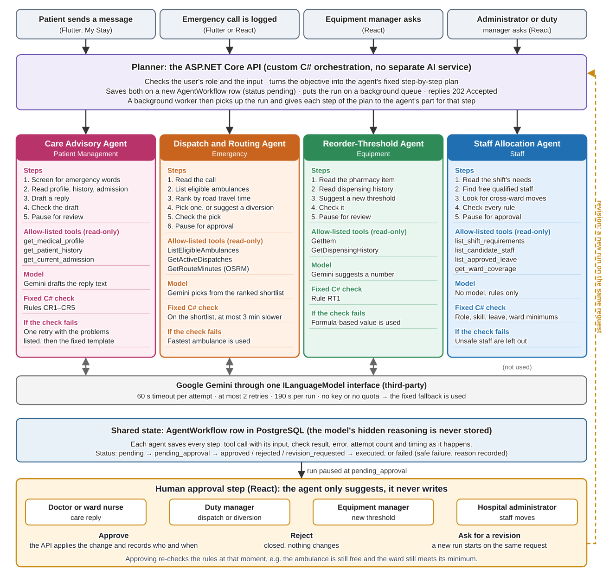
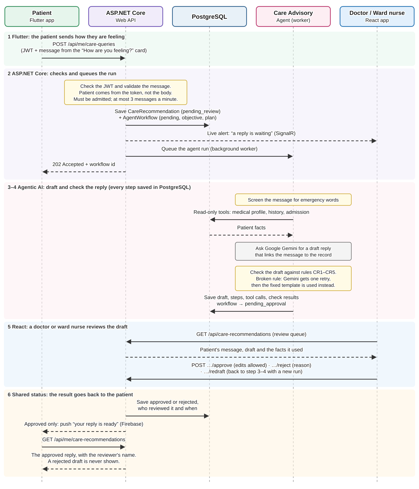
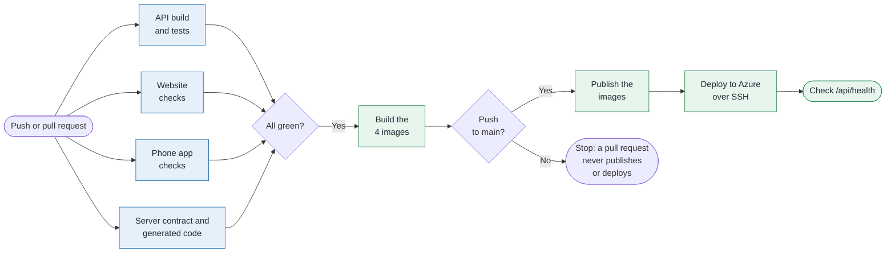

<p align="center">
  
</p>

<p align="center">
  <a href="https://github.com/Nasrullaunais/carelanka/actions/workflows/ci.yml"></a>
  
  <a href="https://github.com/Nasrullaunais/carelanka/releases/latest"></a>
  <br>
  
  
  
  
  
</p>

<p align="center">
  <a href="https://carelanka.uaenorth.cloudapp.azure.com"><b>🌐 Live site</b></a> &nbsp;·&nbsp;
  <a href="https://carelanka.uaenorth.cloudapp.azure.com/swagger"><b>📖 Server docs</b></a> &nbsp;·&nbsp;
  <a href="https://github.com/Nasrullaunais/carelanka/releases/latest"><b>📱 Phone app</b></a> &nbsp;·&nbsp;
  <a href="#-try-it-in-two-minutes"><b>🔑 Test logins</b></a> &nbsp;·&nbsp;
  <a href="#-run-it-on-your-computer"><b>💻 Run it yourself</b></a>
</p>

---

## 🏥 What is CareLanka?

**A hospital has four busy areas, and each one needs to know what the others are doing.**

Ambulances bring patients. Patients need beds. Beds need nurses and equipment.
When each area keeps its own notes, someone always finds out too late.

**CareLanka puts all four in one system.** The hospital can start preparing a bed while the ambulance is still on the road.

- 🖥️ **Staff use a website.** Reception, nurses, doctors and managers.
- 📱 **Patients and ambulance crews use a phone app.**
- 🤖 **Four AI helpers make suggestions.** Which ambulance to send, who can cover a ward, what to reorder, how to reply to a patient.
- ✋ **A person always makes the final call.** An AI helper only lays a note on a manager's desk. The manager signs it or tears it up.

|       **4**       |     **4**     |        **230+**        |         **1,500+**         |          **2**          |
| :---------------: | :-----------: | :--------------------: | :------------------------: | :---------------------: |
| parts of the hospital | AI helpers | actions the server can do | automated tests | apps: website and phone |

**Where do I start?**

| I want to… | Go to |
| :--- | :--- |
| See it working | [Try it in two minutes](#-try-it-in-two-minutes) |
| Run it on my computer | [Run it on your computer](#-run-it-on-your-computer) |
| Understand the design | [How it fits together](#-how-it-fits-together), then [`docs/ADR.md`](docs/ADR.md) |
| Add something | [`docs/BUILD_PLAN.md`](docs/BUILD_PLAN.md), then the file for your part in [`docs/build/`](docs/build) |

---

## 🧩 The four parts

<p align="center">
  
</p>

| Part | Built by | Design plan | Server code |
| :--- | :--- | :--- | :--- |
| 🚑 **Emergency** | Nasrulla Unais | [`emergency-management-plan.md`](specs/emergency-management-plan.md) | [`api/Services/Emergency`](api/Services/Emergency) |
| 👥 **Staff** | Kaveesha | [`staff-management-plan.md`](specs/staff-management-plan.md) | [`api/Services/Staff`](api/Services/Staff) |
| 🧰 **Equipment** | Sethmin | [`equipment-management-plan.md`](specs/equipment-management-plan.md) | [`api/Services/Equipment`](api/Services/Equipment) |
| 🛏️ **Patient** | Lochana | [`patient-management-plan.md`](specs/patient-management-plan.md) | [`api/Services/Patient`](api/Services/Patient) |

---

## ✋ The one rule: the AI suggests, a person decides

**An AI helper never changes the hospital's records by itself.**



Why this is safe:

- 🔒 **The AI can only read.** It has a short list of allowed lookups and no way to write.
- 📏 **Fixed rules decide what is allowed, not the AI.** Example: an ambulance that has already reached its patient is never pulled away.
- 🔁 **The rules run twice.** Once before the suggestion is shown, and again at the moment a person approves it.
- 🛟 **If the AI is down, the helpers still answer** with simple fixed rules.
- 📝 **Every AI run is saved step by step**, so it can be looked at later.

> **What this means for you:** if you build a new AI helper, it proposes. It never writes.

---

## 🛣️ A patient's journey

<p align="center">
  
</p>

An ambulance goes out only after a duty manager confirms it. A bed is chosen by a nurse or reception.
A doctor must clear a patient before discharge. **The AI appears once, at step 2, and it only suggests.**

---

## 👤 Who uses what

| Role | Uses | What they do |
| :--- | :---: | :--- |
| **Patient** | 📱 | Reports an emergency, follows their stay and bill, books visits, asks "How are you feeling?" |
| **Ambulance crew** | 📱 | Accepts a call, follows the route, hands the patient over |
| **General staff / reception** | 🖥️ 📱 | Registers and admits walk-ins, assigns beds, settles bills. On the phone: own shifts and leave |
| **Ward nurse** | 🖥️ | Admits patients, updates their stay, reviews the AI's draft replies |
| **Doctor** | 🖥️ | Gives the clinical clearance without which nobody goes home |
| **Duty manager** | 🖥️ | Confirms ambulances, approves diversions and ICU beds |
| **Hospital administrator** | 🖥️ 📱 | Sets prices, manages staff and rosters, approves leave, confirms new equipment |
| **Equipment manager** | 🖥️ | Runs stock, the pharmacy, maintenance warnings and lab reports |

> 🖥️ website · 📱 phone app. The rule of thumb: **the website decides, the phone does.**
> Anything that says yes or no to a suggestion is on the website. Work done in an ambulance, on a ward or in a bed is on the phone.

---

## 🧭 How it fits together

<a href="AssignmentDocs/CareLanka_architecture_diagram.svg">
  
</a>

<sub>Click the picture to see it full size.</sub>

In plain words:

1. **People use the website or the phone app.** Both talk to the server over a secure connection.
2. **Caddy is the front door.** It adds the secure padlock, shows the website, and passes everything else on to the server.
3. **The server (the API) is the only thing that touches the database.** It checks who you are, applies the hospital's rules, and runs the AI helpers.
4. **Four outside services help.** Google Gemini writes AI drafts. OSRM works out road travel times. OpenStreetMap finds addresses and draws maps. Firebase sends messages to a phone's lock screen.

<details>
<summary><b>🔧 What it is built with</b></summary>

<br>

| Piece | We use | In plain words |
| :--- | :--- | :--- |
| Website | React 19, Vite, TanStack Query | Builds the screens staff see, and keeps them in step with the server |
| Phone app | Flutter, `provider` | One codebase for Android and iPhone screens |
| Server | ASP.NET Core 8 (C#) | The brain: checks logins, applies the rules, talks to the database |
| Database | PostgreSQL 16 through Entity Framework Core | Where everything is stored |
| Live updates | SignalR | Tells the website something changed, so it refreshes by itself |
| AI | Google Gemini free tier, plus our own step-by-step loop in C# | Ranks options and writes drafts. Never has the last word |
| Maps | OpenStreetMap, OSRM | Address search, map pictures, road travel times |
| Phone messages | Firebase | Lock-screen messages |
| Hosting | Azure virtual machine, Docker Compose, Caddy | Runs everything |
| Checks | GitHub Actions | Builds and tests every change, then deploys when all pass |

Why we wrote our own AI loop instead of using a ready-made framework is in [`docs/ADR.md`](docs/ADR.md), decision 1.

</details>

<details>
<summary><b>🤖 The four AI helpers in detail</b></summary>

<br>

<a href="AssignmentDocs/CareLanka_agent_orchestration.svg">
  
</a>

<sub>Click the picture to see it full size.</sub>

And one helper's whole trip, from a patient's phone to a nurse's screen and back:

<a href="AssignmentDocs/CareLanka_care_workflow_sequence.svg">
  
</a>

</details>

---

## 🔑 Try it in two minutes

**The live site is at <https://carelanka.uaenorth.cloudapp.azure.com>.** It is filled with demo data.

| Sign in as | Where | Email or username | Password | Try this |
| :--- | :---: | :--- | :--- | :--- |
| Duty manager | 🖥️ | `duty.rajapaksa@carelanka.lk` | `CareLanka#2026` | Confirm an ambulance |
| Ward nurse | 🖥️ | `nurse.perera@carelanka.lk` | `CareLanka#2026` | Admit a patient, assign a bed |
| Doctor | 🖥️ | `dr.silva@carelanka.lk` | `CareLanka#2026` | Give a clinical clearance |
| Hospital administrator | 🖥️ | `admin.wickrama@carelanka.lk` | `CareLanka#2026` | Staff, prices, leave |
| Equipment manager | 🖥️ | `equip.bandara@carelanka.lk` | `CareLanka#2026` | Pharmacy, warnings, lab |
| Ambulance crew | 📱 | `crew.fernando@carelanka.lk` | `CareLanka#2026` | Open **My run** |
| Patient | 📱 | `demo.emergency` | `Patient#2026` | Report an emergency |

The full list, with what each role can and cannot do, is in [`TEST_ACCOUNTS.md`](TEST_ACCOUNTS.md).
These are demo passwords on demo data.

**The best demo is the whole ambulance story, with four logins:**

1. 📱 As **`crew.fernando`**, open **My run** and allow location. This tells the system where the ambulance is.
2. 📱 As **`demo.emergency`**, press **Request ambulance**.
3. 🖥️ As the **duty manager**, open that call on the emergency board. Send the ambulance yourself, or press **Ask agent** and confirm what the AI suggests.
4. 📱 As **`crew.fernando`** again, accept the run, move it along, and finish with the handover.
5. 🖥️ As the **ward nurse**, find the patient waiting for a bed and assign one.

The full step-by-step script is in [`docs/demo/emergency.md`](docs/demo/emergency.md).

**Get the phone app:** download the `.apk` from the [latest release](https://github.com/Nasrullaunais/carelanka/releases/latest) and open it on an Android phone. Allow installs from unknown sources when asked.

---

## 💻 Run it on your computer

You need **Docker** (with Compose). That is enough to start the server and the database.

```bash
printf 'CARELANKA_JWT_SIGNING_KEY=%s\n' "$(openssl rand -hex 32)" > .env
docker compose up -d --build
curl http://localhost:5231/api/health
```

The first line makes a private login key and **replaces any `.env` you already have**, so run it only once.
The health check should say `"database":"up"`. Then open <http://localhost:5231/swagger> to see every action the server offers.

**The website** needs Node.js. In a second terminal:

```bash
cd web-ui
npm ci
npm run dev
```

Open <http://localhost:5174> and sign in with a staff login from the table above.

<details>
<summary><b>📱 Run the phone app on a USB-connected Android phone</b></summary>

<br>

Turn on USB debugging, plug the phone in, then:

```bash
adb devices
adb reverse tcp:5231 tcp:5231
cd mobile-ui
flutter pub get
flutter run -d YOUR_DEVICE_ID --dart-define=API_BASE_URL=http://127.0.0.1:5231/api
```

`adb reverse` lets the phone reach the server on your computer. Run it again every time you reconnect the phone.
To point the phone app at the live site instead, use `--dart-define=API_BASE_URL=https://carelanka.uaenorth.cloudapp.azure.com/api`.

More detail, and fixes for common problems, are in [`LOCAL_SETUP.md`](LOCAL_SETUP.md).

</details>

<details>
<summary><b>🤖 Turn on the real AI (optional)</b></summary>

<br>

Without a key, every AI helper still works. It answers with its fixed rules instead of Gemini.
To use Gemini, set `LanguageModel__ApiKey` as an environment variable, or run
`dotnet user-secrets set "LanguageModel:ApiKey" "YOUR_KEY" --project api`.
Never put the key in a file that goes into Git.

</details>

<details>
<summary><b>✅ Run the tests</b></summary>

<br>

```bash
dotnet test
cd web-ui && npm test
cd mobile-ui && flutter test
```

The server tests need Docker running. They start a throwaway database, apply the real migrations, and remove it afterwards.

</details>

---

## 🗂️ What is inside

```text
carelanka/
├── api/               The server (ASP.NET Core 8)
│   ├── Controllers/     Front doors: take a request, pass it on, return the answer
│   ├── Services/        The real work and the hospital's rules
│   ├── Agents/          The four AI helpers
│   ├── Data/            Tables and database migrations
│   └── Hubs/            Live updates to the website
├── web-ui/            The website for staff (React)
├── mobile-ui/         The phone app (Flutter), one folder per part
├── tests/             Server tests
├── specs/             Each part's design plan and written list of server actions
├── docs/              Decisions, build plan, table diagram, demo data, demo scripts
├── deploy/            Hosting on Azure: Compose file, Caddy, setup guide
├── scripts/           Checks that CI runs
└── compose.yaml       Starts the server and database on your computer
```

---

## 📐 Five rules that keep four people from tripping over each other

| # | Rule | In plain words |
| :-: | :--- | :--- |
| 1 | **One writer per table** | Like a library where one librarian re-shelves each section. Everyone else asks that librarian |
| 2 | **Controller → Service → Database** | Controllers only pass requests along. Services hold the rules. Nothing else touches the database |
| 3 | **Apps never hand-write server calls** | The server publishes a list of everything it can do. The website and phone app generate their code from it, and a check fails if it is out of date |
| 4 | **Every error looks the same** | One place turns a problem into a clear message with a code the apps can read |
| 5 | **Records are switched off, not erased** | History stays, and a retired ward's name can be used again |

The reasons behind these, and the other settled decisions, are in [`docs/ADR.md`](docs/ADR.md).

---

## 🚀 Checks and deployment

**Every push is built and tested. A red check blocks the deploy.**



Merge to `main` and the live site updates by itself. The server setup is in [`deploy/README.md`](deploy/README.md).

---

## ⚠️ Good to know

- **The AI needs the internet and a free quota.** If either is missing, the helpers use their fixed rules, so nothing stops.
- **Run one copy of the server.** Live updates keep their list of connected browsers in memory, so two copies would not share it. See [`docs/ADR.md`](docs/ADR.md), decision 9.
- **Phone messages show real text on a locked screen.** That is easy to read for anyone nearby. Setting `Notifications:LockScreenDetail` to `Generic` swaps it for a general sentence.
- **Not built yet:** email and text-message alerts, browser push, iPhone push messages.
- **Demo passwords are public.** Change every one before pointing this at anything real.

---

## 📚 Read next

| Document | What it answers |
| :--- | :--- |
| [`docs/CareLanka_Component_Plan.md`](docs/CareLanka_Component_Plan.md) | The four parts, who owns what, and why the website and phone differ |
| [`docs/ADR.md`](docs/ADR.md) | The decisions we settled, and why |
| [`docs/BUILD_PLAN.md`](docs/BUILD_PLAN.md) | Build order and who is waiting on whom |
| [`docs/entity_diagram.md`](docs/entity_diagram.md) | Every table and field |
| [`specs/integration_of_functions.md`](specs/integration_of_functions.md) | Who owns which table, and who may call whom |
| [`specs/ai-orchestration-workflow.md`](specs/ai-orchestration-workflow.md) | How the AI helpers chain together |
| [`TEST_ACCOUNTS.md`](TEST_ACCOUNTS.md) | Every demo login and what it can do |
| [`STUBS.md`](STUBS.md) | Every fake standing in for unbuilt work |
| [`CONTEXT.md`](CONTEXT.md) | The hospital words we use, so everyone means the same thing |
| [`deploy/README.md`](deploy/README.md) | Setting up the Azure server |
| [`LOCAL_SETUP.md`](LOCAL_SETUP.md) | Running everything on your computer |

---

## 🎓 About

Group project for **SE3090 Software Engineering Frameworks**, Year 3 Semester 1, 2026.
**Assignment 1: Integrated Full-Stack and Agentic AI Application Development.**

Built by **Nasrulla Unais** (Emergency), **Kaveesha** (Staff), **Sethmin** (Equipment) and **Lochana** (Patient).
